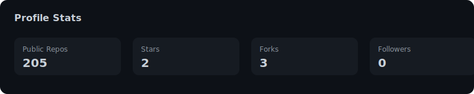
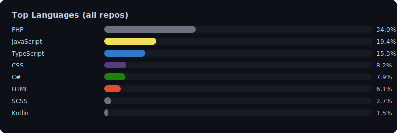

<h2 align="center">Danu</h2>

Backend • Systems • DevOps • IoT Engineering

---

## 📊 Stats

  
  

---

## 🧩 About
I work across multiple layers of the stack — from backend services and system automation to embedded firmware and custom Linux builds.  
Mostly focused on building things that run fast, scale well, and don’t fall apart at 3 AM.

My interests include:
- distributed service workflows  
- containerized backend ecosystems  
- IoT communication pipelines  
- real-time monitoring & automation  
- Linux-based system engineering  

---

## ⚙️ Tech Stack & What I Actually Use
### Backend
- **Node.js** (Express, NestJS)  
- **Go** (workers, service pipelines, IoT backends)  
- **C#/.NET 6/8** (domain modules, scoring engines)

### Infra & Runtime
- Docker (heavy use)  
- GitHub Actions CI/CD  
- Nginx as gateway/reverse proxy  
- Linux (mostly Debian 11/12)  
- Proxmox for service segmentation  

### Data Layer
- PostgreSQL  
- Firebird (legacy systems)  
- SQL Server  
- Redis (cache/message)  
- MinIO (object storage)

### IoT / Hardware
- ESP32-S3 (C++/Arduino)  
- W5500 Ethernet, DHT22, MQ135, PM2.5 sensors  
- OTA pipelines, device provisioning, secure command frames

### Other Areas
- tooling automation  
- arbitrage engines (crypto + live odds)  
- OS remastering (Debian installer, kiosk builds)  

---

## 📌 Stuff I Build
A short list of real things I ship:

- multi-service backend environments  
- IoT device onboarding + heartbeat systems  
- secure device command channels  
- arbitrage & monitoring bots  
- scoring/analytics engines  
- custom Linux OS (auto-installer, kiosk, locked UI)  
- messaging/worker pipelines  

---

## 🛠️ Tools I Use Daily
- Docker / Compose  
- GitHub Actions  
- Bash scripting  
- Nginx  
- Makefiles  
- Git multi-repo workflow  

---

## 🌐 Languages I Touch the Most  
(Automatically updated, includes private repos.)

  

---

## 📫 Contact
**cto.wiqico@gmail.com**
